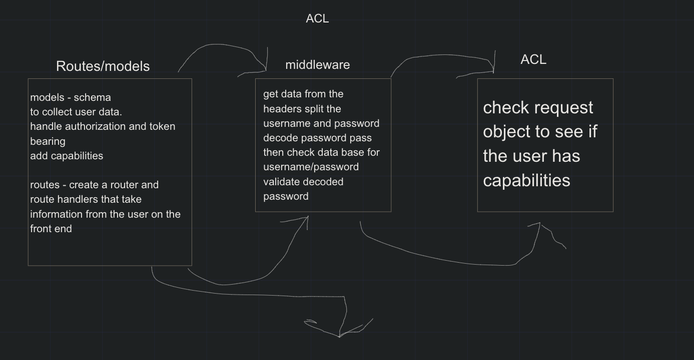
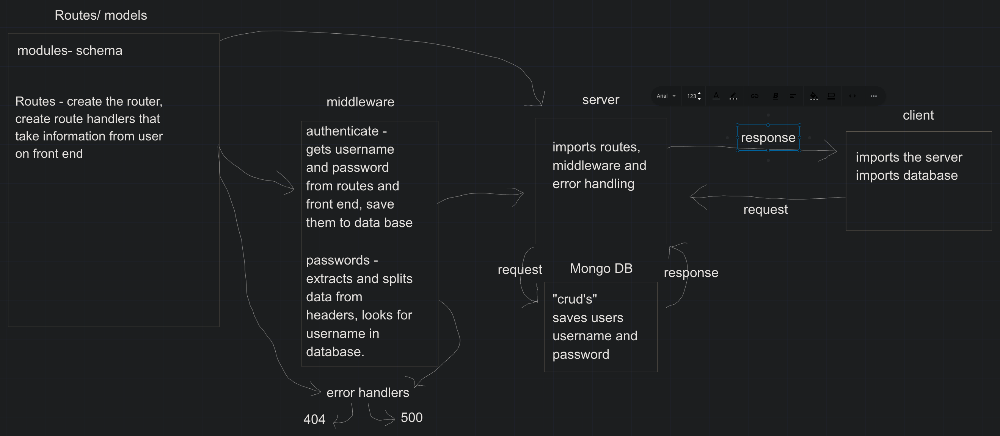

# LAB - Class 8

## Project: Auth-Api

### Author: kale lesko

### Links and Resources

- [ci/cd](https://github.com/Saynka/basic-auth/actions)
- [back-end server url](https://auth-api-practice.herokuapp.com/)
- [front-end application](http://xyz.com)

### Setup

#### `.env` requirements

i.e.

- `PORT` - 3000
- `MONGODB_URI` -
- `base-64": "^1.0.0"`
- `bcrypt": "^5.0.1"`
- `cors: "^2.8.5"`
- `dotenv: "^8.2.0"`
- `express: "^4.17.1"`
- `jest: "^26.6.3"`
- `jsonwebtoken: "^8.5.1"`
- `method-override: "^3.0.0"`
- `mongoose: "^5.12.1"`
- `morgan: "^1.10.0"`
- `supertest: "^6.1.3"`

#### How to initialize/run your application (where applicable)

- `npm init -y`
- `npm install`
- `npm start`
- `node index.js`

#### How to use your library (where applicable)

#### Tests

- npm test

#### UML

